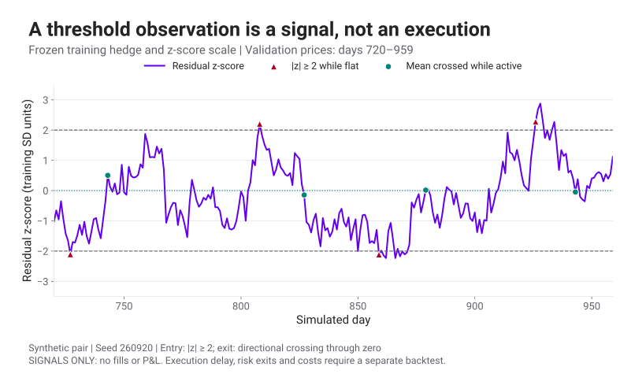

# Pairs Trading 3 · Signals & Backtest

Spread ที่กลับเข้าหาค่าเฉลี่ยจะทำเงินได้หรือไม่ ขึ้นกับราคาเข้าจริง จำนวนหุ้นที่ถือ และต้นทุนระหว่างทาง

[ตอน 2](pairs-trading-cointegration.html) สร้าง residual จากความสัมพันธ์ของราคาแล้ว ตอนนี้เราจะเขียนกติกาที่เครื่องคอมพิวเตอร์ทำตามได้ ตั้งแต่สังเกตสัญญาณจนปิดสถานะ และนับเงินที่เหลือในบัญชี

<section id="z-score">

## แปลง Spread เป็น Z-score

สำหรับ \(s_t=P_{A,t}-\hat\alpha-\hat hP_{B,t}\) ให้ \(\hat\mu_s\) และ \(\hat\sigma_s\) เป็นค่าเฉลี่ยและ sample SD ของ residual ในช่วง train จากนั้นคำนวณ

$$
z_t=\frac{s_t-\hat\mu_s}{\hat\sigma_s}.
$$

[Z-score](glossary.html#pair-z-score) บอกระยะห่างจาก mean ในหน่วย SD เช่น spread=3, mean=0 และ SD=1.5 จะได้ z=2 การเรียกค่ามาตรฐานแบบนี้ไม่ได้ทำให้ spread มีการแจกแจง Normal หรือทำให้เหตุการณ์นอก ±2 มีโอกาสคงที่เสมอ

สำหรับ h>0 ถ้า z เป็นบวกมาก A มีราคาสูงเมื่อเทียบกับความสัมพันธ์ที่ประมาณไว้ กลยุทธ์ mean reversion จะ Short A และ Long h หุ้นของ B ต่อ A หนึ่งหุ้น เมื่อ z เป็นลบมากจะทำกลับกัน คำว่า “สูง” หรือ “ต่ำ” ในที่นี้อิงแบบจำลองของคู่ ไม่ได้สรุปมูลค่าพื้นฐานของบริษัท

| สถานะปัจจุบัน | เงื่อนไขเมื่อปิดวัน t | คำสั่งสำหรับราคาปิดวัน t+1 |
|---|---|---|
| ยังไม่มีสถานะ | z ต่ำกว่า −entry แต่ยังไม่ถึง stop | Long spread: ซื้อ A, ชอร์ต hB |
| ยังไม่มีสถานะ | z สูงกว่า +entry แต่ยังไม่ถึง stop | Short spread: ชอร์ต A, ซื้อ hB |
| มีสถานะ | Spread กลับข้าม mean | ปิดทั้งคู่ |
| มีสถานะ | ถึงระดับ stop หรือครบเวลาถือ | ปิดทั้งคู่ตามกติกา |

<figure class="pairs-figure">

เลื่อนกราฟแนวนอนบนจอเล็ก หรือแตะกราฟเพื่อเปิดขนาดเต็ม

<figcaption>กราฟสัญญาณจากชุด Python · ออกเมื่อข้าม mean · ยังไม่มีการจำลอง fill หรือต้นทุนในภาพนี้ ส่วนห้องทดลองด้านล่างส่งคำสั่งวันถัดไปและทำบัญชีครบสองขา</figcaption>
</figure>

</section>

<section id="execution">

## ระหว่างเห็นสัญญาณกับได้ราคา มีเวลาคั่นอยู่

ถ้าใช้ราคาปิดวัน t คำนวณ z แล้วให้ Backtest ซื้อขายที่ราคาปิดเดียวกันทันที เราต้องอธิบายว่าคำสั่งถูกส่งก่อนรู้ราคานั้นได้อย่างไร ห้องทดลองนี้กำหนดให้เห็นสัญญาณหลังปิดวัน t และซื้อขายที่ราคาปิด t+1 จึงมีหนึ่งวันคั่นไว้เสมอ

กติกานี้ใช้ข้อมูล close อย่างเดียวเพื่อให้ตรวจการเรียงเวลาได้ง่าย ระบบจริงอาจส่งคำสั่งวันถัดไปที่ open หรือใช้ข้อมูล intraday ซึ่งต้องมีราคาซื้อขายและต้นทุนที่สอดคล้องกัน หากราคากระโดดผ่าน stop จะปิดได้ตามราคาที่ซื้อขายจริง ไม่ใช่ราคาที่ตั้ง stop ไว้ในแบบจำลอง

ห้องทดลองประมาณ h, intercept, mean และ SD จากวัน 1–250 แล้วตรึงไว้ ใช้วัน 251–500 ติดตามบัญชี เมื่อขยับ entry หลายครั้งและเลือกผลที่ดีที่สุด ช่วงหลังนี้จะกลายเป็นข้อมูลสำหรับเลือกกติกา ผลบนหน้าจอจึงเป็นการสำรวจตัวอย่าง ไม่ใช่หลักฐานจาก final holdout ที่ไม่เคยเปิดดู

</section>

<section id="pnl-ledger">

## คำนวณ P&L จากหุ้นที่ถือจริง

ให้ \(q_{A,t-1}\) และ \(q_{B,t-1}\) เป็นจำนวนหุ้นที่ถือหลังปิดวันก่อนหน้า จำนวนบวกคือ Long และลบคือ Short ก่อนซื้อขายที่ close วันนี้ เราตีราคาทั้งสองขาก่อน

$$
\Delta\Pi_t=q_{A,t-1}(P_{A,t}-P_{A,t-1})
+q_{B,t-1}(P_{B,t}-P_{B,t-1})-C_t-B_t.
$$

\(C_t\) คือต้นทุนจากการซื้อขายวันนี้ และ \(B_t\) คือค่ายืมหุ้นของช่วงที่ถือ สำหรับต้นทุน c basis points ต่อมูลค่าที่ซื้อขาย

$$
C_t=\frac{c}{10{,}000}
\left(|\Delta q_{A,t}|P_{A,t}+|\Delta q_{B,t}|P_{B,t}\right).
$$

ค่าธรรมเนียมต้องคิดทั้งขาซื้อและขาขาย ทั้งตอนเข้าและออก สมมติ Long A 10,000 และ Short B 10,000 ดอลลาร์ โดยราคาตอนปิดไม่เปลี่ยน ถ้า c=5 bps ต้นทุนเข้าเท่ากับ 10 ดอลลาร์ และต้นทุนออกอีก 10 ดอลลาร์ รวม 20 ดอลลาร์ก่อนค่ายืม

ในตัวทดลอง ค่ายืมรายวันเท่ากับอัตราต่อปี / 252 คูณมูลค่าหุ้นที่ชอร์ต ณ ราคาปิดวันก่อน ไม่รวมดอกเบี้ยเงินสด ปันผล ภาษี หรือข้อจำกัดการยืมหุ้นจริง หุ้นที่ชอร์ตอาจถูกเรียกคืน และ short seller อาจต้องจ่ายชดเชยเงินปันผล จึงต้องเพิ่ม cash flow เหล่านี้ก่อนใช้แบบจำลองกับหลักทรัพย์จริง

P&L ของ spread ในราคาใช้ \(q\Delta s\) ได้เมื่อ h คงที่และถือ \((q,-hq)\) ตามนิยามจริง หากเปลี่ยน h ทุกวัน ต้องบันทึกการปรับจำนวนหุ้นและต้นทุน ห้ามเปลี่ยนเส้น spread ย้อนหลังแล้วนับส่วนต่างของเส้นนั้นเป็นกำไร

</section>

<section id="backtest-lab">

## ทดลองให้ Spread ไม่กลับ แล้วดูบัญชี

ตัวทดลองเริ่มด้วยเงินทุน 100,000 ดอลลาร์ แต่ละครั้งตั้งเป้า gross notional 20,000 ดอลลาร์ คำนวณจำนวนหุ้นจากราคาวันสัญญาณ และถือจำนวนเดิมจนปิด มูลค่าที่ fill วันถัดไปจึงอาจต่างจาก 20,000 ดอลลาร์ ค่าตั้งต้นใช้ entry=2, stop=4, เวลาถือสูงสุด 20 วัน ต้นทุน 5 bps และค่ายืม 3% ต่อปี

ลองเพิ่มต้นทุนโดยตรึงข้อมูลและกติกาไว้ เปรียบเทียบเส้น equity ก่อนและหลังต้นทุน แล้วเปิดตัวเลือกความสัมพันธ์เปลี่ยนเพื่อดูผลของ spread ที่ไม่กลับ ระบบปิดสถานะทั้งหมดในวัน 500 ตามวันสิ้นสุดที่กำหนดล่วงหน้า สมุด trade blotter จึงรวมผลของการบังคับปิดปลายช่วงด้วย

สมุดรายการต้องตอบได้ว่าเห็นสัญญาณวันใด ได้ราคาวันใด ถือ A/B กี่หุ้น ปิดเพราะอะไร เสียต้นทุนเท่าไร และ P&L สุทธิเป็นเท่าไร จำนวน trade ที่น้อยมากให้ข้อมูลเกี่ยวกับกลยุทธ์จำกัด แม้ equity จะดูเรียบก็ตาม

</section>

<section id="performance">

## Win rate ต้องอ่านคู่กับขนาดกำไรและขาดทุน

$$
\text{Win rate}=\frac{\#\{\text{closed trades with net P\&L}>0\}}
{\#\{\text{all closed trades}\}}.
$$

ซีรีส์นี้นับ trade ที่กำไรสุทธิเป็นศูนย์ไว้ในตัวหารด้วย หากยังไม่มี trade ปิด ค่า Win rate ยังนิยามไม่ได้ ตัวอย่างชนะ 9 ครั้ง ครั้งละ 1 ดอลลาร์ และแพ้ 1 ครั้ง 10 ดอลลาร์ ให้ Win rate 90% แต่ P&L รวม −1 ดอลลาร์ก่อนต้นทุน

ผลตอบแทนสะสมของบัญชีคือ \(E_T/E_0-1\) โดย \(E_t\) เป็น equity หลังต้นทุน ถ้าจะคำนวณ [Sharpe ratio](glossary.html#sharpe-ratio) ให้ใช้ค่าเฉลี่ยของผลตอบแทนส่วนเกินต่อช่วง หารด้วย SD ของผลตอบแทนส่วนเกินที่ความถี่เดียวกัน การคูณ \(\sqrt{252}\) เพื่อแสดงต่อปีต้องตรวจสมมติฐานความสัมพันธ์ข้ามวันของ returns ด้วย การนำ Total return ไปหาร daily volatility ตรง ๆ ใช้แทนกันไม่ได้

สำหรับ [drawdown](glossary.html#pair-drawdown) เราวัดการลดลงจากจุดสูงสุดของ equity ที่เกิดขึ้นแล้ว

$$
D_t=1-\frac{E_t}{\max_{u\le t}E_u},\qquad
\operatorname{MDD}=\max_tD_t.
$$

Maximum drawdown เป็นค่าของเส้นทางและช่วงข้อมูลที่ทดสอบ ไม่ทำ annualization และไม่ได้เป็นขาดทุนสูงสุดที่เป็นไปได้ในอนาคต

</section>

<section id="test-discipline">

## แยกช่วงเลือกกติกาออกจากช่วงตัดสินผล

Backtest ต้องจัดเวลาให้ทุกอย่างเป็นสิ่งที่รู้ได้ตอนตัดสินใจ ตั้งแต่รายชื่อหุ้น การจับคู่ การประมาณ h ไปจนถึงการปรับ threshold หากใช้ค่าเฉลี่ยและ SD ของทั้งช่วง หรือเลือกคู่จากหุ้นที่อยู่รอดมาถึงวันนี้ จะมีข้อมูลอนาคตปะปนอยู่

ใช้ train เพื่อประมาณค่า ใช้ validation เพื่อเลือกกติกา และกัน test ชุดสุดท้ายไว้ประเมินหลังเลือกเสร็จ หากย้อนกลับมาแก้โมเดลเพราะเห็นผล test ชุดนั้นแล้ว ให้บันทึกว่าชุดนั้นถูกใช้เพื่อพัฒนาไปแล้ว พร้อมหาข้อมูลใหม่สำหรับการตรวจครั้งถัดไป

ในเอกสารต้นทางหน้า 127–128 มีการใช้ผลของ testing เลือกโมเดลต่อ ในซีรีส์นี้จะเรียกบทบาทนั้นว่า validation และแยก final holdout เพิ่ม ส่วนแนวคิดเรื่องเวลา เหตุการณ์บริษัท และการเปลี่ยนคู่จากหน้า 129–146 นำมาใช้ตั้งสมมติฐานที่จะตรวจทีละข้อ ไม่เลือกช่วงเวลาที่กำไรดีที่สุดแล้วสรุปว่ามีผลจริงทันที

ตอนถัดไปจะใช้กระบวนการนี้กับโมเดลทำนาย และตรวจว่าชนะวิธีง่ายแค่ไหน → [ตอน 4 · Clustering, PCA & Prediction](pairs-trading-ml.html)

</section>

สำหรับการวาง Stop ตามความผันผวนและกรณีคู่ฉีกออก ต่อที่ [ตอน 5 · Cut loss ด้วย Volatility Model](pairs-trading-volatility-stop.html)

## แหล่งข้อมูลและโค้ด

เรียบเรียงใหม่จาก PDF ที่ผู้ใช้ให้ หน้า 86–146 และข้อจำกัด look-ahead ที่ [AlgoAddict ตอนประยุกต์ใช้](https://algoaddict.wordpress.com/2019/06/22/basic-pair-trading-2-การประยุกต์ใช้-cointegration/) กล่าวไว้ ดู [source corrections](data/pairs-trading-provenance.json), [โค้ดตัวทดลอง](https://github.com/nutdnuy/statistical-arbitrage/blob/main/src/pairs-trading.mjs) และ [Notebook การคัดคู่และทำนาย](notebooks/pairs-trading.ipynb)
