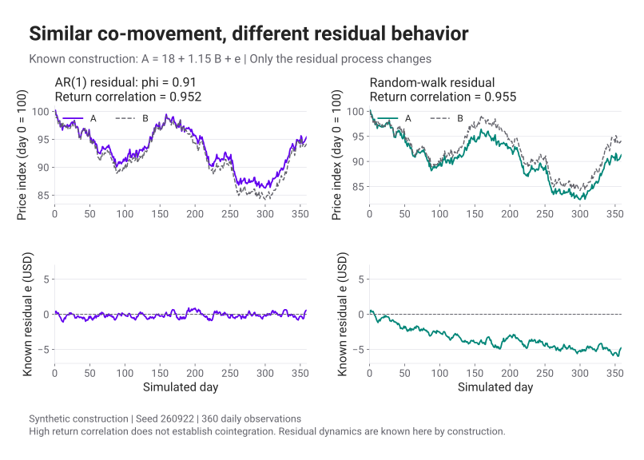

# Pairs Trading 2 · Cointegration

<p class="lead">กราฟราคาสองเส้นอาจดูคล้ายกัน แต่ส่วนต่างของมันอาจเคลื่อนห่างออกไปเรื่อย ๆ</p>

[ตอนแรก](statistical-arbitrage.html) แยกกำไรขาดทุนของ Long–Short แล้ว ตอนนี้เราจะตรวจสมมติฐานที่ทำให้กลยุทธ์ซื้อด้านอ่อนและขายด้านแข็งมีเหตุผล หากส่วนต่างกำลังเปลี่ยนไปอย่างถาวร การรอให้มันกลับอาจทำให้ถือขาดทุนนานขึ้น

<section id="correlation-versus-cointegration">

## Correlation บอกการเคลื่อนไหวร่วมกัน

Correlation ของผลตอบแทนบอกความสัมพันธ์เชิงเส้นในช่วงข้อมูลที่วัด ค่าใกล้ 1 หมายถึงวันที่ A ให้ผลตอบแทนสูงกว่าค่าเฉลี่ย B ก็มักให้ผลตอบแทนสูงกว่าค่าเฉลี่ยด้วย มันไม่ได้กำหนดว่าราคาสองเส้นต้องกลับมามีส่วนต่างเท่าเดิม

ลองสร้างอนุกรมจากช็อกอิสระสองชุด โดย \(X_t\) และ \(Y_t\) เป็น random walk

$$
B_t=X_t,\qquad A_t=X_t+0.2Y_t.
$$

หากช็อกแต่ละชุดมี variance เท่ากัน correlation ของผลต่างหนึ่งช่วงเท่ากับ \(1/\sqrt{1+0.2^2}\approx0.981\) แต่ \(A_t-B_t=0.2Y_t\) ยังเป็น random walk และ variance โตตามเวลา ตัวอย่างนี้เป็นระดับอนุกรมสมมติ ผลต่างของระดับยังไม่ใช่เปอร์เซ็นต์ผลตอบแทนของหุ้น

<figure class="pairs-figure">
<p class="pairs-chart-hint">เลื่อนกราฟแนวนอนบนจอเล็ก หรือแตะกราฟเพื่อเปิดขนาดเต็ม</p>
<div class="pairs-chart-scroll" tabindex="0" role="region" aria-label="กราฟจำลองเปรียบเทียบราคาที่เคลื่อนไหวร่วมกันกับ residual ที่กลับเข้าหาค่าเฉลี่ยและ residual ที่ลอยออก; เลื่อนแนวนอนเพื่ออ่านกราฟ"><a href="assets/images/pairs-correlation-spread.svg" aria-label="เปิดกราฟขนาดเต็ม: กราฟจำลองเปรียบเทียบราคาที่เคลื่อนไหวร่วมกันกับ residual ที่กลับเข้าหาค่าเฉลี่ยและ residual ที่ลอยออก"></a></div>
<figcaption>ข้อมูลจำลอง · อ่านกราฟ residual ควบคู่กับกราฟระดับราคา · เส้นที่ดูคล้ายกันในช่วงสั้นยังใช้ยืนยัน stationarity ไม่ได้</figcaption>
</figure>

</section>

<section id="cointegration-definition">

## Cointegration ตรวจส่วนผสมของอนุกรม

สำหรับกรณีสองตัวแปรที่เราจะใช้ ถ้า \(P_{A,t}\) และ \(P_{B,t}\) เป็น I(1) คือไม่ stationary ในระดับ แต่ผลต่างลำดับหนึ่งเป็น I(0) และมีค่าคงที่ \(\alpha,h\) ที่ทำให้

$$
s_t=P_{A,t}-\alpha-hP_{B,t}
$$

เป็น I(0) เราเรียกว่าคู่นี้มี [cointegration](glossary.html#cointegration) โดย \(s_t\) คือ residual หรือ [spread](glossary.html#pair-spread) ที่นิยามด้วยสมการนี้ ทบทวน [stationarity](glossary.html#stationarity) ได้ก่อนอ่านต่อ การเรียก I(0) ต้องอาศัยสมมติฐานเรื่องกระบวนการและความสัมพันธ์ตามเวลา มากกว่าดูว่าเส้นหนึ่งดูราบ

ตัวอย่างที่เรากำหนดโครงสร้างเองคือ

$$
P_{B,t}=X_t,\qquad P_{A,t}=20+1.3X_t+u_t,\qquad
u_t=0.8u_{t-1}+\varepsilon_t.
$$

\(X_t\) มี stochastic trend ส่วน \(u_t\) เป็น AR(1) ที่ \(|0.8|<1\) และเริ่มจากการแจกแจง stationary การลบ \(20+1.3P_{B,t}\) ออกจาก A จะเหลือ \(u_t\) การลบราคา A−B ตรง ๆ กลับเหลือ \(20+0.3X_t+u_t\) ซึ่งยังมี trend ร่วมติดอยู่ ค่า h จึงเปลี่ยนสิ่งที่เรากำลังทดสอบ

แบบจำลองเชิงบวกสำหรับราคาหุ้นจริงอาจใช้ log price แต่ห้ามสลับหน่วยกลางทาง ถ้าสัญญาณเป็น \(\log P_A-\alpha-h\log P_B\) สัมประสิทธิ์ h เป็นความสัมพันธ์ใน log scale; ส่วน P&L ต้องคำนวณจากจำนวนหุ้นและราคาซื้อขายจริง

</section>

<section id="engle-granger">

## ประมาณความสัมพันธ์โดยใช้เฉพาะข้อมูลฝึก

ในช่วง formation หรือ train เราหา \(\hat\alpha,\hat h\) ด้วย OLS ของ A บน B แล้วตรวจ residual ด้วยวิธี Engle–Granger การทดสอบนี้ใช้สมมติฐานว่าอนุกรมอินพุตเป็น I(1) และใช้ critical values ที่เหมาะกับ residual ซึ่งได้จากการประมาณ regression มาแล้ว

```python
from statsmodels.tsa.stattools import coint

# a_train and b_train contain synchronized training observations only.
statistic, p_value, critical_values = coint(
    a_train, b_train, trend="c", maxlag=5, autolag="aic"
)
```

H₀ ของคำสั่งนี้คือไม่มี cointegration ถ้า p-value ต่ำกว่าเกณฑ์ที่กำหนดไว้ เช่น 0.05 เราปฏิเสธ H₀ ภายใต้ข้อสมมติของการทดสอบ p=0.01 ไม่ได้แปลว่า spread จะกลับด้วยโอกาส 99% และการปฏิเสธ H₀ ไม่ได้บอกว่าจะกลับเมื่อไรหรือทำกำไรหลังต้นทุนได้เท่าไร ดูนิยามพารามิเตอร์และผลลัพธ์ที่ [statsmodels: coint](https://www.statsmodels.org/stable/generated/statsmodels.tsa.stattools.coint.html)

Notebook ประกอบแสดงผลทดสอบจากชุดจำลองจริงและระบุค่าที่ส่งให้ฟังก์ชัน ค่าทดสอบอาจต่างกันเมื่อเปลี่ยน trend term, lag, หน้าต่างข้อมูล หรือสลับตัวแปรตามกับตัวแปรอิสระ ควรบันทึกการตัดสินใจเหล่านี้ก่อนเห็นผลช่วงทดสอบ

หากมีหุ้น 100 ตัว จะมี 4,950 คู่ให้ลอง ภายใต้กรณีสมมติที่ทุก H₀ เป็นจริงและแต่ละการทดสอบมีขนาด 5% จำนวนการปฏิเสธผิดที่คาดหมายคือ 247.5 คู่ แม้การทดสอบจะไม่อิสระจากกัน ตัวเลขนี้ใช้สอน multiple testing ไม่ใช่จำนวนคู่ผิดที่ทราบล่วงหน้าในข้อมูลจริง การจำกัด universe ด้วยเหตุผลทางเศรษฐศาสตร์และการควบคุม false discovery ช่วยลดการคัดจากผลที่ดูดีโดยบังเอิญได้

</section>

<section id="residual-lab">

## เปลี่ยน h แล้วดูว่าเหลืออะไรใน Spread

<div id="pair-cointegration-lab"></div>

ข้อมูลในตัวทดลองมี 500 วันสมมติ ใช้ 250 วันแรกประมาณความสัมพันธ์ จากนั้นตรึงค่าประมาณไว้ ส่วนตัวเลือกความสัมพันธ์เปลี่ยน ให้ residual หลัง train เดินแบบ random walk การทำเช่นนี้สร้างเหตุการณ์ที่สมมติฐาน mean reversion ใช้ต่อไม่ได้โดยตั้งใจ

ปรับ h ให้ห่างจากค่าที่ประมาณได้ แล้วดูกราฟ residual อีกครั้ง เส้นที่เคยแกว่งรอบระดับเดิมจะมีส่วนของ trend เหลือมากขึ้น ตัวทดลองแสดงกลไกจากข้อมูลที่สร้างเอง จึงไม่แสดง p-value ที่แต่งขึ้นเพื่อให้หน้าตาดูเหมือนผลทดสอบตลาด

</section>

<section id="half-life">

## Half-life เป็นความเร็วภายใต้แบบจำลอง

ถ้าใช้ AR(1) แบบง่ายกับ spread ที่หัก mean แล้ว

$$
\mathbb E[s_{t+k}\mid s_t]=\phi^k s_t,\qquad
k_{1/2}=\frac{\log(0.5)}{\log\phi},\quad 0<\phi<1,
$$

เมื่อ \(\phi=0.8\) จะได้ half-life ประมาณ 3.11 ช่วงสังเกต ถ้าข้อมูลเป็นรายวัน หน่วยก็คือวันซื้อขาย นี่คือเวลาที่ค่าคาดหมายของส่วนเบี่ยงเบนลดลงครึ่งหนึ่ง ไม่ใช่วันนัดที่ทุกเส้นทางจะกลับถึงเป้าหมาย

เมื่อประมาณ \(\phi\ge1\) สูตรนี้ไม่ให้ half-life ของการลู่กลับตามแบบจำลอง ถ้า \(\phi<0\) การตอบสนองจะสลับเครื่องหมายและต้องอธิบายอีกแบบ แม้ \(0<\phi<1\) ช่วงความไม่แน่นอนของค่าประมาณและการเปลี่ยนโครงสร้างก็ยังมีผลต่อการกำหนดเวลาถือ

ก่อนแปลง spread เป็นสัญญาณ เราต้องกำหนดด้วยว่า “ห่างมาก” เทียบกับระดับความผันผวนใด → [ตอน 3 · Signals & Backtest](pairs-trading-backtest.html)

</section>

## แหล่งอ่านต่อ

เส้นเรื่องได้รับแรงบันดาลใจจาก [AlgoAddict: Idea of Cointegration](https://algoaddict.wordpress.com/2019/06/22/basic-pairs-trading-1-idea-of-cointegration/) และ [ตอนประยุกต์ใช้](https://algoaddict.wordpress.com/2019/06/22/basic-pair-trading-2-การประยุกต์ใช้-cointegration/) เราอธิบาย p-value ใหม่และแยกข้อมูล train เพื่อหลีกเลี่ยงการเห็นข้อมูลอนาคต ดู [บันทึกแหล่งข้อมูล](data/pairs-trading-provenance.json) และ [Notebook](notebooks/pairs-trading.ipynb)
