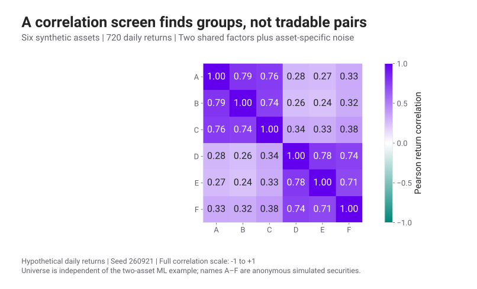
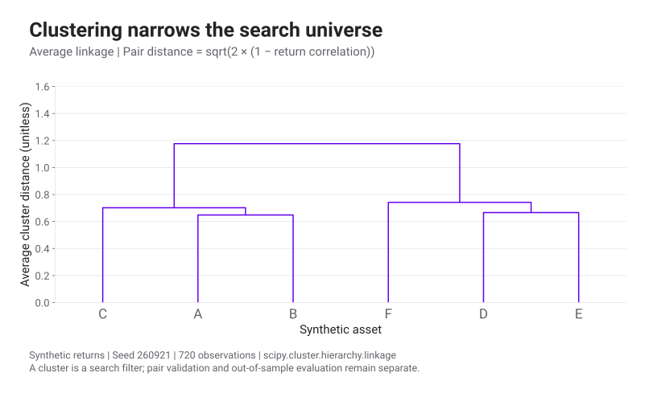
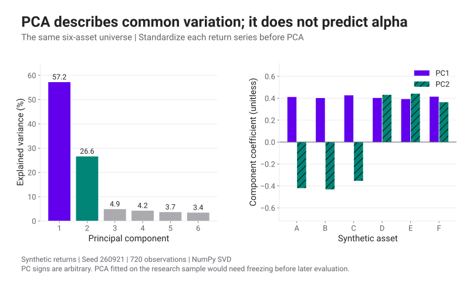
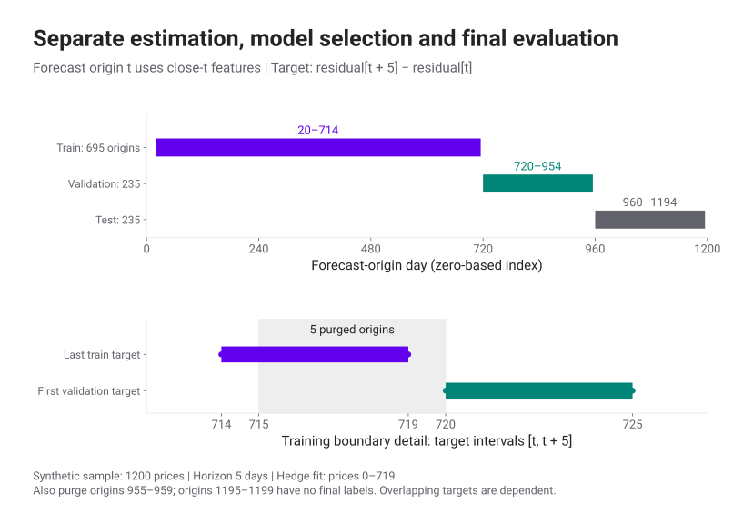
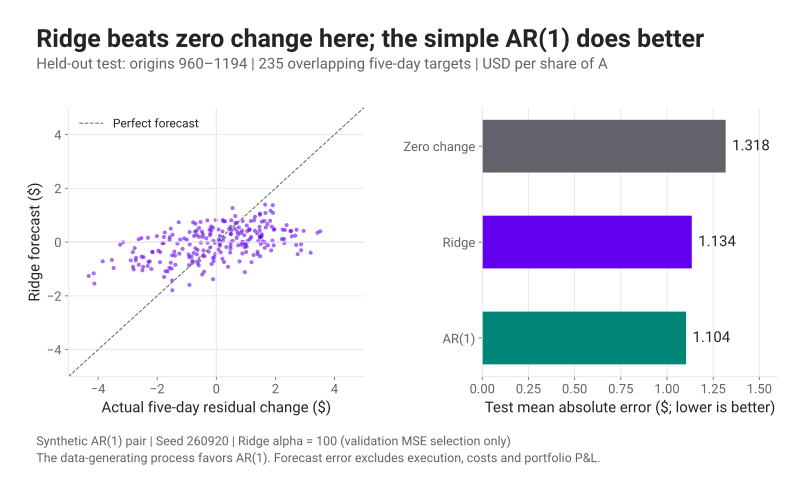

# Pairs Trading 4 · Clustering, PCA & Prediction

เมื่อมีหุ้นให้เลือกหลายตัว เราต้องแยกงานค้นหากลุ่มที่คล้ายกันออกจากงานทำนายว่าจะเกิดอะไรขึ้นต่อ

Clustering จัดกลุ่มจากรูปแบบข้อมูล ส่วน PCA ลดมิติของปัจจัยร่วม ทั้งสองอย่างช่วยจำกัดผู้สมัครสำหรับการสร้างคู่ แต่ยังไม่ได้ให้คำตอบว่าควรซื้อหรือขายเมื่อไร ตอนนี้จะใช้ข้อมูลจำลองให้เห็นการคัดกลุ่ม แล้วสร้างโมเดลทำนาย residual ที่ตรวจผลได้ด้วย Notebook

เนื้อหาการคัดคู่ต่อยอดจาก PDF หน้า 37–85 ส่วนโมเดล Ridge และการเปรียบเทียบ holdout เป็นตัวอย่างที่พัฒนาขึ้นสำหรับซีรีส์นี้ ไม่ใช่การนำ lab หรือเฉลยของ Coursera มาทำซ้ำ ผลทั้งหมดเป็นของข้อมูลสมมติ

<section id="clustering">

## จากตารางผลตอบแทนเป็นกลุ่มหุ้น

เริ่มจากตารางที่แถวเป็นวันและคอลัมน์เป็นหุ้น ทุกคอลัมน์ต้องอยู่บนวันเดียวกัน จัดการ missing values ก่อนคำนวณความสัมพันธ์ ถ้าต้องการเปรียบเทียบรูปแบบการเคลื่อนไหวมากกว่าขนาด volatility ให้ standardize โดยใช้ค่าเฉลี่ยและ SD ของแต่ละหุ้นใน train

<figure class="pairs-figure">

เลื่อนกราฟแนวนอนบนจอเล็ก หรือแตะกราฟเพื่อเปิดขนาดเต็ม

<figcaption>ข้อมูลสมมติ A–F · Correlation ของผลตอบแทนในช่วง train · หุ้นในกลุ่มเดียวกันอาจรับปัจจัยร่วม แต่ยังไม่ได้ผ่านการตรวจ cointegration</figcaption>
</figure>

ระยะห่างแบบหนึ่งที่ใช้กับ correlation คือ \(d_{ij}=\sqrt{2(1-\rho_{ij})}\) เมื่อ \(\rho=1\) ระยะห่างเป็นศูนย์ และเมื่อ \(\rho=-1\) ระยะห่างเป็น 2 ต้องระบุด้วยว่าใช้ linkage แบบใดในการรวมกลุ่ม เพราะวิธีวัดความใกล้ระหว่างสองกลุ่มให้ผลต้นไม้ต่างกันได้

<figure class="pairs-figure">

เลื่อนกราฟแนวนอนบนจอเล็ก หรือแตะกราฟเพื่อเปิดขนาดเต็ม

<figcaption>อ่านความสูงที่แต่ละกลุ่มถูกรวม ไม่ใช่ระยะห่างแนวนอนระหว่างชื่อหุ้น · วิธี linkage และข้อมูลต้นทางระบุใน Notebook</figcaption>
</figure>

เมื่อตัดต้นไม้ที่ระดับหนึ่งจะได้กลุ่มผู้สมัคร จากนั้นตรวจเหตุผลทางธุรกิจ สภาพคล่อง ความสามารถในการยืมหุ้น และเสถียรภาพของ spread เพิ่ม การย้ายระดับตัดจน Backtest ดูดีที่สุดต้องถูกนับเป็นการเลือกพารามิเตอร์ด้วย

</section>

<section id="pca">

## PCA บอกทิศทางที่อธิบายความแปรปรวน

สำหรับเมทริกซ์ผลตอบแทนที่ center และ scale แล้ว \(R\) เราแยกทิศทางหลักจาก covariance/correlation matrix PCA เรียงทิศทางตาม variance ที่อธิบายได้ Eigenvector บอกน้ำหนักของหุ้นในทิศทางนั้น ส่วนคะแนนของแต่ละวันคือผลตอบแทนวันนั้นที่ฉายลงบนทิศทางดังกล่าว

<figure class="pairs-figure">

เลื่อนกราฟแนวนอนบนจอเล็ก หรือแตะกราฟเพื่อเปิดขนาดเต็ม

<figcaption>คำนวณจากผลตอบแทนสมมติชุดเดียวกับ Heatmap · Explained variance วัดการอธิบายข้อมูล train ไม่ใช่ความแม่นยำในการทำนาย</figcaption>
</figure>

คำว่า loading ใช้ต่างกันระหว่างตำราและซอฟต์แวร์ บางแห่งหมายถึง eigenvector weight บางแห่งคูณรากของ eigenvalue เพิ่ม รูปและ Notebook ใช้ eigenvector ที่มีความยาวเท่ากับ 1 หรือ right singular vector โดยไม่ได้คูณรากของ eigenvalue

เครื่องหมายของ eigenvector กลับทั้งคอลัมน์ได้โดยไม่เปลี่ยน PCA หุ้นที่มี PC2 คนละเครื่องหมายจึงไม่ได้บอกว่าตัวไหนจะชนะในอนาคต และ PC1 ไม่จำเป็นต้องเป็น market beta เสมอไป

งาน [Avellaneda & Lee](https://math.nyu.edu/inmemoriam/avellaneda/AvellanedaLeeStatArb20090616.pdf) ใช้ PCA และ sector ETF เพื่อแยกองค์ประกอบร่วมก่อนศึกษาการกลับเข้าหาค่าเฉลี่ยของ residual เป็นแนวทางขยายจากคู่เดียวไปหลายสินทรัพย์ งานนี้ศึกษาช่วงตลาดในอดีต เราไม่ได้ใช้ผลตอบแทนของงานนั้นเป็นเป้าหมายของตัวอย่างปัจจุบัน

</section>

<section id="prediction-target">

## กำหนดสิ่งที่จะทำนายให้ตรงหน่วย

Notebook สร้างคู่ A/B อีกชุดหนึ่งจำนวน 1,200 observations ด้วย seed 260920 แยกจากชุด 500 วันในห้องทดลอง Backtest จากนั้นประมาณราคา A บน B ด้วย train เท่านั้น และนิยาม residual \(s_t\) เหมือนตอน 2

เป้าหมายของโมเดลเป็นการเปลี่ยนแปลง residual ในอีกห้าวัน

$$
y_t=s_{t+5}-s_t.
$$

หน่วยคือดอลลาร์ต่อหุ้น A เมื่อ hedge ด้วย h หุ้น B คงที่ โมเดลทำนายค่าเป็นบวกหมายถึงคาดว่า spread จะสูงขึ้น การตีความเป็น Long/Short ยังต้องใช้สถานะปัจจุบัน เวลาที่ได้ fill และต้นทุนประกอบ ค่า \(y_t\) นี้ยังไม่ได้เป็นผลตอบแทนของพอร์ต

Features ประกอบด้วย z-score ปัจจุบัน การเปลี่ยน spread ย้อนหลัง 1 และ 5 วัน SD ของการเปลี่ยน spread 20 วัน และ simple return ของ B ย้อนหลัง 5 วัน ค่าเฉลี่ยและ SD สำหรับ scale features fit จาก train เท่านั้น เมื่อใช้กับ validation/test การคำนวณ feature วัน t ใช้ราคาได้ถึง close t ดูตัวอย่างปัญหาข้อมูลรั่วใน [scikit-learn: Data leakage](https://scikit-learn.org/stable/common_pitfalls.html#data-leakage)

แถว train เป็นตัวอย่างย้อนหลังที่สร้างด้วย hedge ซึ่งประมาณจาก train ทั้งช่วง เพื่อใช้ฝึกโมเดลหลังจบช่วงนั้น เราไม่ได้อ้างว่าเป็นสัญญาณที่ซื้อขายได้จริงในแต่ละวันของ train การตรึงค่าประมาณก่อนเริ่ม validation/test เป็นขอบเขตที่ใช้ตรวจเรื่องข้อมูลอนาคต

เราทดลอง Ridge regression เพื่อให้สัมประสิทธิ์ถูกจำกัดขนาดตามค่าปรับโทษ \(\lambda\)

$$
\min_{b,\theta}\;\sum_{t\in\mathrm{train}}
(y_t-b-x_t^\top\theta)^2+\lambda\|\theta\|_2^2.
$$

Intercept b ไม่ถูกลงโทษในตัวอย่างนี้ การเลือก \(\lambda\) ใช้ validation MSE ไม่ดูผล test ระหว่างเลือก และไม่ได้ค้นหา feature หลายชุดจนเลือกชุดที่ชนะ test

</section>

<section id="time-split">

## เว้นช่องว่างให้ Label ไม่ข้ามชุดข้อมูล

ถ้า feature อยู่วัน t แต่ label ใช้ราคาถึง t+5 ตัวอย่างใกล้รอยต่ออาจใช้ราคาของชุดถัดไป เราจึงตัด origin ห้าวันสุดท้ายก่อนแต่ละรอยต่อออกจากชุดก่อนหน้า

<figure class="pairs-figure">

เลื่อนกราฟแนวนอนบนจอเล็ก หรือแตะกราฟเพื่อเปิดขนาดเต็ม

<figcaption>ดัชนี observation เริ่มที่ 0 · ช่องว่างมีไว้กัน label ข้ามขอบเขต ไม่ได้ทำให้ข้อมูลรายวันเป็นอิสระจากกัน</figcaption>
</figure>

| หน้าที่ | ดัชนี origin ที่ใช้ | จำนวนตัวอย่าง |
|---|---:|---:|
| Train โมเดล | 20–714 | 695 |
| ตัดก่อน validation | 715–719 | 5 |
| Validation เลือก penalty | 720–954 | 235 |
| ตัดก่อน test | 955–959 | 5 |
| Test ประเมินครั้งสุดท้าย | 960–1194 | 235 |

ราคา 0–719 ใช้ประมาณ hedge และสถิติของ spread ส่วน 20 วันแรกเป็นประวัติสำหรับสร้าง features Label ของ origin 714 จบที่ 719 และ label ของ origin 954 จบที่ 959 จึงไม่ล้ำเข้าสู่ชุดถัดไป โมเดลในตัวอย่างไม่ได้ refit หลังเลือก penalty เพื่อให้ตรวจที่มาของสัมประสิทธิ์ได้ตรงไปตรงมา

เมื่อใช้ walk-forward ในข้อมูลจริง ต้องทำการคัดหุ้น เลือกคู่ fit PCA และ preprocessing ใหม่จากอดีตของแต่ละรอบด้วย `TimeSeriesSplit` ช่วยจัดช่วงได้ แต่ผู้เขียนยังต้องกำหนด gap ให้สอดคล้องกับ label เอง ดู [เอกสาร TimeSeriesSplit](https://scikit-learn.org/stable/modules/generated/sklearn.model_selection.TimeSeriesSplit.html)

</section>

<section id="model-results">

## เปรียบเทียบกับวิธีง่ายก่อน

Baseline แรกทำนายว่า residual ไม่เปลี่ยน จึงให้ \(\hat y_t=0\) ทุกครั้ง ส่วน baseline ที่สองประมาณ AR(1) จาก train แล้วทำนายห้าวันข้างหน้า การเปรียบเทียบนี้ตรวจว่า features เพิ่มเติมของ Ridge มีประโยชน์เกินความสัมพันธ์ตามเวลาที่ง่ายกว่าหรือไม่

<figure class="pairs-figure">

เลื่อนกราฟแนวนอนบนจอเล็ก หรือแตะกราฟเพื่อเปิดขนาดเต็ม

<figcaption>Test 235 ตัวอย่างจากข้อมูลสมมติ · Label ใช้หน้าต่างห้าวันที่ซ้อนทับกัน โดยวันติดกันแชร์การเปลี่ยนแปลงสี่วัน จึงห้ามนับเป็นการทดลองอิสระ 235 ครั้ง</figcaption>
</figure>

| วิธี | Test MAE | Test RMSE |
|---|---:|---:|
| ไม่เปลี่ยนแปลง | 1.3178 | 1.6165 |
| AR(1) จาก train | 1.1035 | 1.3798 |
| Ridge เลือก penalty ด้วย validation | 1.1344 | 1.4068 |

หน่วยทั้งสองคอลัมน์เป็นดอลลาร์ต่อหุ้น A ค่าเล็กกว่าหมายถึงทำนาย residual change ผิดน้อยกว่า Ridge ที่เลือก penalty=100 ชนะ zero-change ใน seed นี้ แต่ยังมี error สูงกว่า AR(1) ผลนี้ยังไม่บอกว่าโมเดลใดทำกำไรหลังต้นทุนดีกว่า และไม่ใช่หลักฐานว่า Ridge จะชนะเมื่อเปลี่ยนช่วงตลาด

ดูตัวเลขเต็ม พารามิเตอร์และเวอร์ชันซอฟต์แวร์ใน [ผลคำนวณที่บันทึกไว้](data/pairs-ml-results.json) Notebook ใช้ข้อมูลเดียวกันและรันการตรวจว่า การเปลี่ยน test ไม่ทำให้พารามิเตอร์ที่ฝึกและตัวเลือก penalty เปลี่ยน รวมทั้งการเปลี่ยนข้อมูลอนาคตไม่ทำให้ feature ในอดีตเปลี่ยน

</section>

<section id="next-experiment">

## ก่อนนำ Prediction ไปออกคำสั่ง

ต้องกำหนดจังหวะสัญญาณและ fill ใหม่ให้ตรงกับเป้าหมาย หากส่งคำสั่งได้ที่ close t+1 การเปลี่ยน spread ตั้งแต่ close t ถึง t+1 เป็นช่วงที่เรายังไม่ได้ถือหุ้น Label สำหรับคัดกำไรของ trade จึงควรใช้หน้าต่างที่เริ่มจากราคาเข้าจริง และต้องหักต้นทุนของสองขาเหมือน [ตอน 3](pairs-trading-backtest.html#pnl-ledger)

เมื่อข้อมูลจริงมีความสัมพันธ์เปลี่ยน อาจศึกษาการประมาณ hedge แบบ rolling หรือ Kalman filter ต่อได้ Kalman filter ต้องเลือก state equation, observation equation และ noise covariance ให้ชัด รวมทั้งนับการซื้อขายจากการปรับ hedge วิธีที่ตามข้อมูลเร็วขึ้นอาจเพิ่ม turnover และตาม noise มากขึ้นด้วย

สำหรับการทดลองครั้งต่อไป ให้เปลี่ยนเพียงหนึ่งสมมติฐาน เช่น ความเร็ว mean reversion หรือความแรงของ structural break กำหนดเกณฑ์ประเมินก่อนรัน และเก็บผลที่ไม่ดีไว้ด้วย เริ่มได้จาก [ดาวน์โหลด Notebook](notebooks/pairs-trading.ipynb)

</section>

## แหล่งข้อมูลและขอบเขตที่ตรวจแล้ว

อ่าน PDF ที่ผู้ใช้ให้ครบ 146 หน้าและใช้เป็นโครงเรื่องการ hedge, clustering, PCA, backtesting และเหตุการณ์ตลาด ส่วน [Coursera Module 5](https://www.coursera.org/learn/machine-learning-trading-finance/home/module/5) ตรวจโครงหัวข้อผ่าน [syllabus สาธารณะ](https://www.coursera.org/learn/machine-learning-trading-finance) ไม่ได้เข้าชมวิดีโอหรือเฉลย lab ที่จำกัดสิทธิ์

[YouTube: Basic Statistical Arbitrage](https://www.youtube.com/watch?v=g-qvFjvyqcs&t=23s) ตรวจชื่อวิดีโอได้จากดัชนีค้นหา แต่ยังไม่ได้ตรวจ transcript จึงใส่เป็นแหล่งเปิดดูต่อ ไม่ใช้ยืนยันคำพูดหรือรายละเอียดในวิดีโอ ดู [provenance ทั้งซีรีส์](data/pairs-trading-provenance.json)
