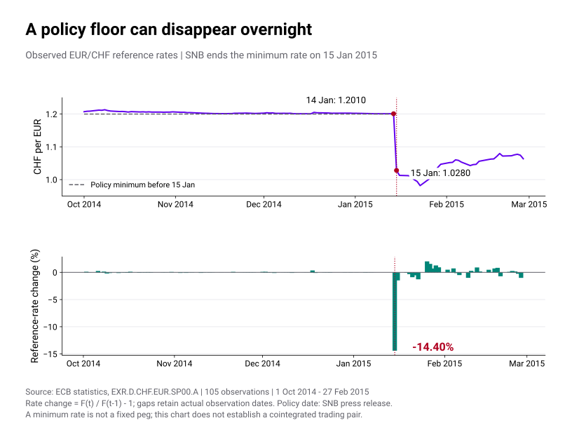
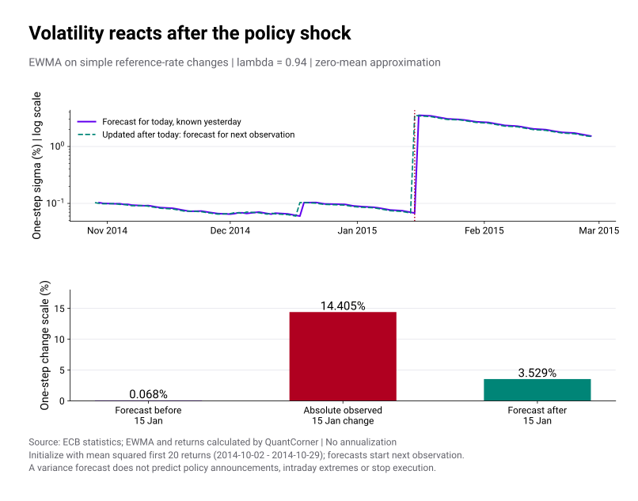
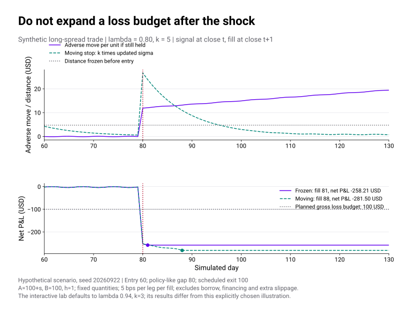

# Pairs Trading 5 · Cut loss ด้วย Volatility Model

เมื่อคู่ที่เคยเดินด้วยกันฉีกออกจากกัน Volatility Model ช่วยกำหนดขนาดสถานะและระยะ Cut loss ได้ แต่ราคาที่ปิดจริงอาจทำให้ขาดทุนเกินงบ

[ตอน 2](pairs-trading-cointegration.html) อธิบายว่า Cointegration เป็นคุณสมบัติของกระบวนการภายใต้เงื่อนไขหนึ่ง ส่วน [ตอน 3](pairs-trading-backtest.html) แยกสัญญาณออกจากราคา fill เราจะใช้ Volatility Model วางขนาดสถานะและระยะ Cut loss โดยตรึงงบขาดทุนของสถานะเดิมไว้ แม้ vol จะเพิ่มขึ้น

<section id="policy-breaks">

## เมื่อกรอบนโยบายอัตราแลกเปลี่ยนเปลี่ยนไป

ความผันผวนต่ำอาจสะท้อนการแทรกแซงหรือกรอบอัตราแลกเปลี่ยน เมื่อกรอบนั้นถูกยกเลิก กระบวนการสร้างราคาอาจเปลี่ยนไปด้วย

| เหตุการณ์ | สิ่งที่เปลี่ยน | สิ่งที่คนถือคู่ควรตั้งคำถาม |
|---|---|---|
| ปอนด์อังกฤษ · 16 กันยายน 1992 | อังกฤษระงับการอยู่ใน ERM หลังการแทรกแซงและแรงกดดันต่อตลาดเงิน | หากความสัมพันธ์กับมาร์กเยอรมันพึ่งกรอบ ERM อยู่ จะยังใช้ระดับเดิมเป็นเป้าหมายได้หรือไม่? |
| เงินบาท · 2 กรกฎาคม 1997 | ไทยเปลี่ยนจากระบบอัตราแลกเปลี่ยนคงที่อิงตะกร้าเงินเป็นลอยตัว | ความนิ่งในอดีตประเมินความเสี่ยงหลังเปลี่ยนระบบต่ำไปหรือไม่? ควรทบทวนสมมติฐานที่เคยอิงตะกร้าเงินเดิมด้วย |
| ฟรังก์สวิส · 15 มกราคม 2015 | SNB ยกเลิกอัตราขั้นต่ำ 1.20 CHF ต่อ EUR | ถ้า Long EUR / Short CHF โดยเชื่อว่าอัตราขั้นต่ำจะอยู่ต่อ ความเสี่ยงที่ไม่เคยปรากฏในช่วงสงบคืออะไร? |

แหล่งประวัติศาสตร์: [Bank of England: กรกฎาคม–กันยายน 1992](https://www.bankofengland.co.uk/quarterly-bulletin/1992/q4/operation-of-monetary-policy), [ธปท.: บทเรียนวิกฤตปี 1997](https://www.bot.or.th/en/our-roles/special-measures/Tom-Yum-Kung-lesson.html) และ [งานวิจัย ธปท. เรื่องประวัติระบบอัตราแลกเปลี่ยน](https://content.botlc.or.th/mm-info/BOTCollection/BOTDP/dp062009.pdf), [ประกาศ SNB วันที่ 15 มกราคม 2015](https://www.snb.ch/en/publications/communication/press-releases/2015/pre_20150115)

ทั้งรัฐบาลและธนาคารกลางมีบทบาทต่างกันในแต่ละเหตุการณ์ ตารางนี้เป็นตัวอย่างการเปลี่ยนกรอบนโยบาย ไม่ใช่ผลทดสอบว่าคู่เงินเหล่านี้เคย cointegrated หรือหลักฐานว่ากลยุทธ์ใดจะทำกำไรได้

</section>

<section id="snb-2015">

## EUR/CHF: อัตราขั้นต่ำหายไปในวันที่ 15 มกราคม 2015

SNB ยกเลิก minimum exchange rate ที่ 1.20 CHF ต่อ EUR ในวันดังกล่าว กรอบนี้เป็นอัตราขั้นต่ำ ไม่ใช่คำสัญญาว่าราคาจะเท่ากับ 1.20 ตลอดเวลา การวางแผนว่าคู่จะกลับสู่เส้นนั้นหลังประกาศจึงต้องมีเหตุผลใหม่รองรับ

ข้อมูลอ้างอิง ECB ให้ค่า 1.2010 CHF ต่อ EUR วันที่ 14 มกราคม และ 1.0280 วันที่ 15 มกราคม คำนวณการเปลี่ยนแปลงเป็น \(1.0280/1.2010-1=-14.40\%\) หมายถึงหนึ่งยูโรแลกฟรังก์ได้น้อยลง ตัวเลขนี้ไม่ใช่การบอกว่าฟรังก์แข็งค่า 14.40% ในการกลับด้าน quote และไม่ใช่ราคาต่ำสุดระหว่างวัน

<figure class="pairs-figure">

เลื่อนกราฟแนวนอนบนจอเล็ก หรือแตะภาพเพื่อเปิดขนาดเต็ม

<figcaption>Source: ECB statistics · 105 จุดข้อมูล วันที่ 1 ต.ค. 2014–27 ก.พ. 2015 · หน่วย CHF ต่อ 1 EUR · กราฟเปอร์เซ็นต์เป็นการคำนวณของผู้เขียนจากอัตราอ้างอิง ไม่ใช่ราคา fill หรือ intraday low</figcaption>
</figure>

ECB ระบุว่าอัตราอ้างอิงมีไว้เพื่อให้ข้อมูลและไม่ควรใช้เป็นราคาทำธุรกรรม จึงใช้ชุดนี้ศึกษาขนาดการเปลี่ยนแปลงและข้อจำกัดของ vol forecast เท่านั้น ไม่ใช้สร้าง Backtest ที่อ้างว่าส่งคำสั่งและปิดได้ตามตัวเลขเหล่านี้ [คำอธิบายอัตราอ้างอิง ECB](https://www.ecb.europa.eu/stats/policy_and_exchange_rates/euro_reference_exchange_rates/html/index.en.html)

เก็บ [CSV ต้นฉบับพร้อม metadata](data/ecb-chf-eur-2014-2015.csv) และ [วิธีคำนวณกับ SHA-256](data/pairs-fx-policy-risk.json) ไว้ตรวจย้อนหลัง ใช้เฉพาะวันที่ ECB มีข้อมูล ไม่เติมราคาให้วันหยุด และไม่ใช้ข้อมูลหลังเหตุการณ์ไปประมาณ vol ก่อนเหตุการณ์

</section>

<section id="spread-volatility">

## Vol ของระดับ Spread กับ Vol ของการเปลี่ยนแปลง

ให้ hedge ratio h คงที่ และราคาทั้งสองขาอยู่ในสกุลบัญชีเดียวกัน

$$
s_t=P_{A,t}-\alpha-hP_{B,t},\qquad x_t=\Delta s_t=s_t-s_{t-1}.
$$

SD ของ **ระดับ spread** ที่ใช้ทำ z-score ตอบว่า s อยู่ห่าง mean แค่ไหน ส่วน [conditional volatility](glossary.html#conditional-volatility) ของ **การเปลี่ยนแปลง spread** ตอบว่าในหนึ่งช่วงถัดไปมันอาจเคลื่อนมากเพียงใด ระยะ Cut loss ในบทนี้ใช้ vol ของการเปลี่ยนแปลง spread

| ปริมาณ | ใช้ตอบอะไร | สิ่งที่ยังสรุปไม่ได้ |
|---|---|---|
| \((s_t-\mu_s)/\sigma_s\) | ห่างจาก mean ของระดับ spread กี่ SD | จะกลับมาแน่นอนหรือภายในกี่วัน |
| \(\widehat\sigma_{t+1\mid t}\) ของ \(\Delta s\) | ขนาดความผันผวนหนึ่งช่วงถัดไปภายใต้โมเดล | ราคาจะไม่กระโดดเกินค่านี้ |
| \(|\Delta s_t|/\widehat\sigma_{t\mid t-1}\) | การเคลื่อนไหวที่เพิ่งเกิดใหญ่กว่าที่โมเดลเคยประเมินแค่ไหน | ความน่าจะเป็นแบบ Normal หรือการยืนยัน structural break |

ถ้าถือ Long spread จำนวน q หน่วยเป็น \((q,-hq)\) และไม่เปลี่ยน h กำไรขาดทุนก่อนต้นทุนในหนึ่งช่วงคือ \(q\Delta s_t\) ดังนั้น vol ของ P&L เป็น \(|q|\widehat\sigma\) เมื่อเปลี่ยน h ระหว่างถือ ต้องทำบัญชีการปรับ hedge ด้วย ไม่ใช้ส่วนต่างของ spread ที่นิยามใหม่แทนเงินที่ได้จริง

</section>

<section id="ewma-model">

## เริ่มด้วย EWMA ที่ตรวจลำดับเวลาได้

ภายใต้การประมาณว่า mean ของ x ต่อหนึ่งช่วงเป็นศูนย์ [EWMA](glossary.html#ewma) อัปเดต second moment เป็น

$$
\widehat\sigma^2_{t+1\mid t}
=\lambda\widehat\sigma^2_{t\mid t-1}+(1-\lambda)x_t^2,
\qquad 0<\lambda<1.
$$

ค่า λ สูงทำให้จำอดีตนานขึ้น ค่า λ ต่ำตอบสนองต่อข้อมูลล่าสุดมากขึ้น ค่า 0.94 เป็นจุดเริ่มต้นที่ใช้กับข้อมูลรายวันใน RiskMetrics ไม่ใช่ค่าที่เหมาะกับทุกคู่และทุกความถี่ [RiskMetrics Technical Document, บท 5](https://www.msci.com/documents/10199/5915b101-4206-4ba0-aee2-3449d5c7e95a)

เมื่อ x มี mean ที่ไม่เป็นศูนย์ การใช้ \(x_t^2\) ตรง ๆ จะรวมส่วนของ mean เข้าไปด้วย ถ้าจะสร้างโมเดล mean ให้ใช้ error ที่ได้จากการพยากรณ์ด้วยข้อมูลอดีต ไม่หักค่าเฉลี่ยจากข้อมูลทั้งช่วงย้อนหลัง ค่า vol ที่เพิ่มเพราะ drift ไม่ได้ทำให้ spread กลับมา stationary

ในกรณี ECB เราใช้ \(x_t=F_t/F_{t-1}-1\) ซึ่งเป็น simple return ของอัตราอ้างอิง จึงแสดง σ เป็นเปอร์เซ็นต์ ส่วนตัวทดลองสองขาด้านล่างใช้ \(\Delta s\) และแสดง σ เป็น USD ต่อหน่วย ทั้งสองใช้สูตรเดียวกันแต่เป็นคนละหน่วย

เริ่ม variance จากค่าเฉลี่ยกำลังสองของ returns 20 จุดแรก วันที่ 2–29 ตุลาคม 2014 จากนั้นคำนวณ forecast ไปข้างหน้าทีละจุด ก่อนเห็นข้อมูลวันที่ 15 มกราคม ได้ σ ประมาณ 0.068% แต่การเปลี่ยนแปลงที่เกิดขึ้นมีขนาด 14.405% หลังนำเหตุการณ์นี้เข้ามาแล้ว ค่า forecast สำหรับจุดถัดไปจึงเพิ่มเป็นประมาณ 3.529%

<figure class="pairs-figure">

เลื่อนกราฟแนวนอนบนจอเล็ก หรือแตะภาพเพื่อเปิดขนาดเต็ม

<figcaption>Source: ECB statistics · EWMA และ returns คำนวณโดยผู้เขียน · λ=0.94; mean ประมาณเป็นศูนย์ · กราฟบนใช้แกน σ แบบ logarithmic · ไม่ annualize และไม่แปลงขนาด surprise เป็น Normal-tail probability</figcaption>
</figure>

ถ้าใช้ σ ที่อัปเดตด้วย shock วันนี้ไปอ้างว่าโมเดลรู้อยู่แล้วก่อน shock จะเป็นการสลับเวลา โมเดลเรียนรู้จากสิ่งที่เกิดแล้วได้ แต่สูตรนี้ไม่ได้มีข้อมูลการตัดสินใจนโยบายที่ยังไม่ประกาศ

### การประมาณ Vol ด้วย GARCH

GARCH(1,1) เพิ่มส่วนคงที่และแยกน้ำหนักของ shock กับ variance เดิม

$$
\widehat\sigma^2_{t+1\mid t}=\omega+a\varepsilon_t^2+b\widehat\sigma^2_{t\mid t-1}.
$$

ในสูตรนี้ \(\varepsilon_t\) คือ forecast error จาก mean model ใช้ \(\omega>0,a,b\ge0\) และภายใต้เงื่อนไขมาตรฐาน \(a+b<1\) เพื่อให้ unconditional variance มีค่าจำกัด ประมาณ mean model และพารามิเตอร์จาก train เท่านั้น แล้วเลือกวิธีบน validation ที่แยกตามเวลา บทนี้ใช้ EWMA ในการคำนวณ ส่วน GARCH แสดงเฉพาะสูตร ยังไม่ได้ประมาณพารามิเตอร์ การเปลี่ยนโมเดล variance ไม่ได้ทำให้นโยบายกระโดดหรือ liquidity gap หายไป

</section>

<section id="risk-budget">

## ตั้งขนาดสถานะและระยะ Cut loss ก่อนเข้า

สมมติสังเกตข้อมูลถึง close e−1 แล้วกำหนดขนาดสำหรับเข้า close e ให้ R เป็นงบขาดทุน **ก่อนต้นทุน** ต่อรอบ และ G เป็นเพดาน gross notional เป้าหมาย

$$
D_{\mathrm{entry}}=k\widehat\sigma_{e\mid e-1},\qquad
q=\min\left(\frac{R}{D_{\mathrm{entry}}},
\frac{G}{P_{A,e-1}+|h|P_{B,e-1}}\right).
$$

D เป็นระยะในหน่วย spread ส่วน q เป็นจำนวนหน่วยของขา A กำหนดหน่วยและราคาทั้งสองขาให้สอดคล้องกัน หาก σ เล็กมาก ขนาดจาก R/D จะโตมาก จึงต้องมีเพดาน gross, ข้อจำกัด margin/liquidity และปฏิเสธการเข้าเมื่อค่าประมาณใช้ไม่ได้ ราคาที่ fill อาจทำให้ gross จริงต่างจากเป้าหมายได้

ในตัวอย่าง Long spread ใช้เงื่อนไขขาดทุนต่อหน่วย \(s_e-s_t\ge D_{\mathrm{entry}}\) ส่วน Short spread ใช้ \(s_t-s_e\ge D_{\mathrm{entry}}\) ตรวจหลัง close t แล้วปิดทั้งสองขาที่ close t+1 ตามราคาที่มีจริง ห้ามแทนราคา fill ด้วยเส้น Stop เมื่อราคากระโดดผ่านไปแล้ว

**kσ เป็นกติกาวางระยะ ไม่ใช่เพดานขาดทุนที่รับประกัน** และไม่ใช่ VaR ของการถือหลายวันโดยอัตโนมัติ การใช้ \(\sqrt H\) ขยายจากหนึ่งวันเป็น H วันต้องตรวจสมมติฐานการสะสม variance ด้วย ทั้งความสัมพันธ์ข้ามเวลาและ jump ทำให้การขยายแบบง่ายคลาดเคลื่อนได้

สำหรับเงินทุน 10,000 USD ในตัวทดลอง ตั้ง R=100 USD หรือ 1% ของเงินทุนก่อนต้นทุน และ G=20,000 USD ต้องนับค่าธรรมเนียมเพิ่ม ในการใช้งานจริงควรกันงบต้นทุนและตรวจเพดานขาดทุนสุทธิแยกต่างหาก ตัวเลข 1%, k และ G นี้เป็นค่าประกอบการสอน ไม่ใช่ข้อแนะนำให้ใช้กับทุกบัญชี

</section>

<section id="moving-stop">

## Stop ที่ขยายตาม Vol เพิ่มงบขาดทุนของสถานะเดิม

ถ้าตั้ง Stop ใหม่ทุกวันเป็น \(D_t=k\widehat\sigma_{t+1\mid t}\) หลังเห็น shock ระยะอาจขยายขึ้นมาก ขณะที่ q ของสถานะเดิมยังเท่าเดิม งบขาดทุนที่ยอมรับโดยปริยายจึงโตตามไปด้วย ในช่วงสงบระยะนี้อาจแคบลงและปิดเร็วกว่าวิธีตรึงก็ได้ ผลไม่ได้ดีกว่าหรือแย่กว่าทุกเส้นทาง

ใช้ vol ล่าสุดประเมินความเสี่ยงและกำหนดขนาดสถานะใหม่ ส่วนสถานะเดิมให้ยึดงบขาดทุนที่ตั้งไว้ตอนเข้า หากจะลดสถานะหรือบีบ Stop ให้แคบลง ต้องนับการซื้อขายจริง ไม่ขยายวงเงินเพียงเพราะโมเดลปรับตัวตามราคาที่เสียไปแล้ว

<figure class="pairs-figure">

เลื่อนกราฟแนวนอนบนจอเล็ก หรือแตะภาพเพื่อเปิดขนาดเต็ม

<figcaption>ข้อมูลสมมติ · seed 20260922 · λ=0.80, k=5 เพื่อแสดงกลไกการขยายระยะ · หนึ่งรอบซื้อขาย ไม่ใช่ผลเลือกกติกาที่ดีที่สุด · ทั้งสองวิธียังขาดทุนเกินงบได้จาก gap และการรอ fill</figcaption>
</figure>

</section>

<section id="vol-stop-lab">

## ทดลองให้คู่ฉีกออก แล้วดูว่า Stop ปิดได้เมื่อไร

ตัวทดลองกำหนด \(P_A=100+s,P_B=100,h=1\) หน่วยราคาเป็น USD เป็นคู่สินทรัพย์สมมติ ไม่ใช่ EUR/CHF จริง กำหนดวันเข้าไว้ล่วงหน้าเพื่อศึกษาผลของกติกา Stop โดยยังไม่มีสัญญาณหา alpha ใช้ข้อมูลถึงวัน 59 คำนวณ σ และ q เปิด close 60 กรอบสถานการณ์ใหม่เริ่มวัน 80 และปิดไม่เกิน close 100 ตามวันสิ้นสุดที่กำหนดไว้

ลองสามอย่างตามลำดับ:

1. ใช้ค่าตั้งต้น λ=0.94, k=3 กับ gap 12 USD ทั้งสองวิธีเห็น Stop วันที่ 80 และ fill วันที่ 81 ผลสุทธิประมาณ −432.24 USD เทียบกับงบก่อนต้นทุน 100 USD การมี Stop ไม่ได้ทำให้ปิดขาดทุนได้แค่ 100
2. เปลี่ยน λ เป็น 0.80 และ k เป็น 5 กรณีกระโดดเดิมจะทำให้วิธีขยับ Stop ยอมรอถึงสัญญาณวัน 87 ก่อน fill วัน 88 ส่วนวิธีตรึง fill วัน 81 นี่คือพารามิเตอร์ของภาพด้านบน ไม่ใช่ค่าตั้งต้น
3. เปลี่ยนเป็น “ค่อย ๆ ฉีกออก” และ “ผันผวนขึ้นรอบ mean เดิม” ดูว่าเวลาออกต่างกันอย่างไร การเลือกกติกาต้องทดสอบบนหลายเส้นทางและข้อมูลที่ยังไม่เคยใช้ปรับพารามิเตอร์

บัญชีคิดค่าใช้จ่าย 5 bps ของแต่ละขาทุกครั้ง ทั้งเปิดและปิด แต่ยังไม่รวมค่ายืม ดอกเบี้ย margin call และ slippage นอกเหนือจากการ fill วันถัดไป หลังปิดแล้วไม่เปิดใหม่ เส้นขาดทุนต่อหน่วยที่ยังเดินต่อจึงแสดงผลกรณีที่ยังถือ ส่วนเส้น P&L ของบัญชีหยุดเปลี่ยนเมื่อปิดจริง

</section>

<section id="break-circuit">

## เมื่อสมมติฐานพัง ให้หยุดคู่นั้นด้วย

Stop ปิดสถานะหนึ่งรอบ แต่ถ้าระบบยังเห็น spread ห่างจาก mean เดิมแล้วเปิดซ้ำทันที ความเสียหายอาจเกิดซ้ำ ต้องมี [circuit breaker](glossary.html#risk-circuit-breaker) ระดับคู่และระดับบัญชีเพิ่มเติม

| สิ่งที่เฝ้าดู | กติกาที่ควรระบุก่อนรัน | ข้อจำกัด |
|---|---|---|
| ความผันผวนหรือ standardized shock เกินเกณฑ์ | พักการเปิดใหม่ ตรวจราคาและสภาพคล่อง; ถ้าเงื่อนไขระบุให้ลด/ปิดสถานะ จัดการทั้งสองขา | เกณฑ์ c ที่เลือกไว้บน validation ไม่ได้เป็นความน่าจะเป็น Normal โดยอัตโนมัติ |
| ขาดทุนสุทธิต่อคู่/ต่อวัน/ต่อบัญชี | หยุดรับความเสี่ยงเพิ่มและส่งคำสั่งลดความเสี่ยงตามกติกา | ราคากระโดดและสภาพคล่องทำให้ขาดทุนเกินเพดานก่อน fill ได้ |
| ข่าวเปลี่ยนกรอบอัตราแลกเปลี่ยนหรือข้อจำกัดตลาด | พักคู่จนตรวจสมมติฐานและ hedge ใหม่ | ใช้เวลาเผยแพร่ข่าวที่มีจริง ห้ามใส่ flag ย้อนหลังว่าโมเดลรู้ล่วงหน้า |
| Residual มี mean/drift เปลี่ยน หรือการทดสอบความสัมพันธ์ไม่เสถียร | จัดเป็นเหตุให้สอบสวน [structural break](glossary.html#structural-break) ไม่รีบแก้ mean เพื่อเปิดเพิ่ม | การทดสอบจากหน้าต่างจำกัดมีทั้ง false alarm และการตรวจพบช้า |

ตารางนี้เป็นข้อกำหนดสำหรับต่อยอดระบบ ตัวทดลองด้านบนเปรียบเทียบ Stop สองแบบเท่านั้น ยังไม่ได้จำลองข่าว เพดานขาดทุนสุทธิ หรือการพักแล้วกลับมาเปิดใหม่

ก่อนกลับมาซื้อขาย ให้ตรวจคุณภาพข้อมูลและสภาพคล่องของตลาด ประมาณ hedge/mean/vol ด้วยข้อมูลที่มี ณ เวลานั้น แล้วทดสอบบนช่วงหลังที่ยังไม่เคยใช้เลือกกติกา การ fit ใหม่ให้กราฟดูนิ่งไม่ใช่หลักฐานว่าคู่นั้นกลับมามีเหตุผลทางเศรษฐศาสตร์

</section>

<section id="risk-validation">

## ทดสอบทั้งขาดทุนที่ลดลงและโอกาสที่เสียไป

เปรียบเทียบกติกาบนรายการเข้าเริ่มต้นเดียวกันก่อน เพื่อแยกผลของ exit แล้วจึงทดสอบระบบเต็มที่ entry และขนาดเปลี่ยนตาม vol ตรวจ P&L สุทธิ ขาดทุนเกินงบ จำนวนครั้งที่พักคู่ เวลาที่ไม่มีสถานะ และรอบที่ถูกตัดก่อน spread กลับ กำหนด train/validation/test ตามลำดับเวลาและเก็บผลที่ไม่ดีไว้ด้วย

ทดสอบความไวต่อ λ, k, เพดาน gross, ความล่าช้าในการ fill และต้นทุน ไม่เลือกเหตุการณ์ปี 2015 เพื่อแต่งกติกาแล้วใช้ปี 2015 เป็น final holdout ซ้ำ กรณีนี้เป็น stress case ทางประวัติศาสตร์ที่เลือกมาศึกษาข้อจำกัด ไม่ใช่การพิสูจน์ความสามารถพยากรณ์นอกตัวอย่าง

</section>

## ข้อมูลและการทำซ้ำ

- [ECB CSV ต้นฉบับ](data/ecb-chf-eur-2014-2015.csv) · [สรุปการคำนวณและที่มา](data/pairs-fx-policy-risk.json) · [เงื่อนไขนำสถิติ ECB ไปใช้](https://www.ecb.europa.eu/stats/ecb_statistics/governance_and_quality_framework/html/usage_policy.en.html)
- [บัญชีจำลองและพารามิเตอร์](data/pairs-vol-stop-demo.json) · [โค้ด EWMA และ Stop](https://github.com/nutdnuy/statistical-arbitrage/blob/main/src/vol-stop.mjs)
- [Notebook ทั้งซีรีส์](notebooks/pairs-trading.ipynb) ฝังภาพและข้อมูล EUR/CHF ที่ใช้คำนวณไว้ เปิดได้โดยไม่ดึงราคาจากอินเทอร์เน็ต
