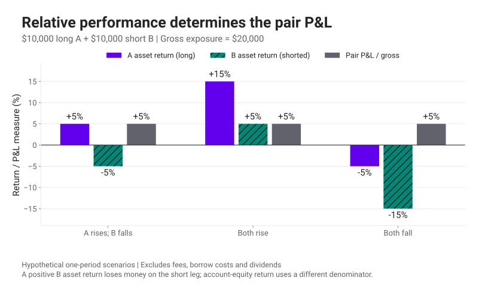

# Statistical Arbitrage · เริ่มจาก Pairs Trading

หุ้นสองตัวลงพร้อมกัน พอร์ตที่ซื้อหนึ่งตัวและขายชอร์ตอีกตัวอาจยังมีกำไรได้ ถ้าตัวที่ซื้อเสียหายน้อยกว่าตัวที่ชอร์ต

Pairs Trading ให้เราทดสอบความสัมพันธ์ของสินทรัพย์สองตัว แทนที่จะคาดเดาราคาของสินทรัพย์ตัวเดียว ในซีรีส์นี้เราจะสร้างกลยุทธ์ที่ซื้อด้านซึ่งอ่อนกว่าความสัมพันธ์ที่ประมาณไว้ และขายชอร์ตด้านซึ่งแข็งกว่า แล้วตรวจว่ารายรับจากการกลับเข้าหากันเหลือพอหลังหักต้นทุนหรือไม่

คำว่า Statistical Arbitrage ครอบคลุมกลยุทธ์ที่ใช้ความสัมพันธ์ทางสถิติสร้างสัญญาณซื้อขาย บางกลยุทธ์ถือหลายสิบหรือหลายร้อยสินทรัพย์เพื่อกระจายความเสี่ยง ส่วน Pairs Trading เป็นจุดเริ่มต้นที่เห็นบัญชีกำไรขาดทุนได้ครบทั้งสองขา ความสัมพันธ์ที่เคยพบอาจเปลี่ยนไป และการถือ Long–Short ยังขาดทุนได้

<figure class="pairs-figure">

<figcaption>New York Stock Exchange · ภาพโดย <a href="https://commons.wikimedia.org/wiki/File:New_York_Stock_Exchange_-_Frontal_-_NYSE.jpg">www.elbpresse.de / Chs87</a> · <a href="https://creativecommons.org/licenses/by-sa/4.0/">CC BY-SA 4.0</a> · ภาพต้นฉบับไม่ดัดแปลง ใช้ประกอบบริบทตลาด ไม่ได้แสดงผลของกลยุทธ์</figcaption>
</figure>

## เส้นทางของซีรีส์

| ตอน | สิ่งที่จะทำได้หลังอ่าน | ภาพและการทดลอง |
|---|---|---|
| 1 · หน้านี้ | แยกกำไรของสองขาและเลือกความเสี่ยงที่ต้องการ hedge | กราฟสามสถานการณ์และตัวปรับ hedge |
| [2 · Cointegration](pairs-trading-cointegration.html) | สร้าง residual และอ่านผลทดสอบโดยไม่แปล p-value เกินความหมาย | ราคาเทียบ spread และตัวทดลองความสัมพันธ์ที่เปลี่ยนไป |
| [3 · Signals & Backtest](pairs-trading-backtest.html) | เปลี่ยน z-score เป็นคำสั่งซื้อขายพร้อมสมุดบัญชีต้นทุน | กราฟ signal, equity และ trade blotter |
| [4 · Clustering, PCA & Prediction](pairs-trading-ml.html) | คัดกลุ่มหุ้นและทดสอบโมเดลทำนายด้วยข้อมูลตามลำดับเวลา | Heatmap, dendrogram, PCA และ Notebook ที่รันได้ |

ใช้ความรู้เรื่อง [Returns](https://nutdnuy.github.io/quantitative-finance-notes/prices-and-returns.html), ค่าเฉลี่ย, ส่วนเบี่ยงเบนมาตรฐาน และเส้นถดถอยเชิงเส้นประกอบได้ ตัวเลข A/B และผลทดลองในซีรีส์เป็นข้อมูลสมมติทั้งหมด ไม่มีคู่หุ้นแนะนำหรือผล Backtest ของตลาดจริง

<section id="two-legs">

## อ่านกำไรขาดทุนทีละขา

สมมติซื้อหุ้น A มูลค่า 10,000 ดอลลาร์ และ [ขายชอร์ต](glossary.html#short-selling) หุ้น B มูลค่า 10,000 ดอลลาร์ เมื่อปิดทั้งสองขา กำไรก่อนต้นทุนคือ

$$
\Pi=10{,}000r_A-10{,}000r_B.
$$

\(r_A,r_B\) คือ simple return ระหว่างเปิดและปิดสถานะ ไม่รวมเงินปันผล เครื่องหมายลบของขา B มาจากการขายก่อนแล้วซื้อคืน ถ้าราคา B ลง ขานี้จะมีกำไร

| ราคาช่วงที่ถือ | P&L ของ Long A | P&L ของ Short B | P&L รวม |
|---|---:|---:|---:|
| A +5%, B −5% | +500 | +500 | +1,000 ดอลลาร์ |
| A +15%, B +5% | +1,500 | −500 | +1,000 ดอลลาร์ |
| A −5%, B −15% | −500 | +1,500 | +1,000 ดอลลาร์ |

<figure class="pairs-figure">

เลื่อนกราฟแนวนอนบนจอเล็ก หรือแตะกราฟเพื่อเปิดขนาดเต็ม

<figcaption>ตัวอย่างสมมติเดียวกันทั้งสามกรณี · Long และ Short มีมูลค่าเริ่มต้นเท่ากัน · ยังไม่หักต้นทุน</figcaption>
</figure>

ส่วนต่าง \(r_A-r_B=10\%\) ยังต้องมีฐานเงินทุนก่อนเรียกว่า “ผลตอบแทนพอร์ต” ถ้าวัดเทียบ [gross notional](glossary.html#gross-notional) 20,000 ดอลลาร์ จะได้ 1,000 / 20,000 = 5% หากกันเงินทุนไว้ 25,000 ดอลลาร์ จะได้ 4% เงินสดสุทธิจากการเปิดสองขาอาจใกล้ศูนย์ แต่ผู้ซื้อขายยังต้องมีหลักประกันและรับความเสี่ยง ห้ามนำกำไรไปหารด้วยเงินลงทุนสุทธิที่ใกล้ศูนย์

เมื่อปรับมูลค่าสองขาไม่เท่ากัน สูตรต้องกลับไปใช้ \(\Pi=N_A r_A-N_B r_B\) โดย \(N_A,N_B\) เป็นมูลค่าแต่ละขาตอนเปิด การลบเปอร์เซ็นต์ตรง ๆ จะไม่ให้ P&L ของพอร์ตนั้นแล้ว

</section>

<section id="hedge-ratios">

## Hedge ratio สามแบบตอบคนละโจทย์

Dollar neutral กำหนดให้มูลค่า Long เท่ากับมูลค่า Short ส่วน beta neutral กำหนดให้ความไวต่อตลาดของสองขาหักล้างกัน โดยประมาณ market beta จากผลตอบแทนที่สอดคล้องกันทั้งช่วงเวลาและ benchmark

$$
\beta_i=\frac{\operatorname{Cov}(r_i,r_M)}{\operatorname{Var}(r_M)},\qquad
\beta_A N_A-\beta_B N_B=0.
$$

ถ้าซื้อ A 10,000 ดอลลาร์ โดย \(\beta_A=1.2\) และ \(\beta_B=0.8\) จะต้องขายชอร์ต B 15,000 ดอลลาร์เพื่อให้ beta exposure ประมาณศูนย์ พอร์ตนี้มี gross notional 25,000 ดอลลาร์ และ net notional −5,000 ดอลลาร์

จำนวนหุ้นยังขึ้นกับราคา เช่น A ราคา 100 และ B ราคา 50 ดอลลาร์ จะถือ A +100 หุ้น และ B −300 หุ้น ถ้าจะปัดจำนวนหุ้น ต้องคำนวณ exposure ที่เหลืออีกครั้ง Market beta เป็นค่าประมาณในอดีต จึงเปลี่ยนได้หลังเปิดสถานะ และไม่ได้ครอบคลุมความเสี่ยงของบริษัทแต่ละแห่ง

| วิธี | เงื่อนไข | สิ่งที่ยังเหลืออยู่ |
|---|---|---|
| Dollar neutral | \(N_A=N_B\) | market beta อาจไม่เท่ากัน |
| Market-beta neutral | \(\beta_A N_A=\beta_B N_B\) | ความเสี่ยงเฉพาะบริษัทและ beta ที่เปลี่ยน |
| Cointegration hedge | เลือก h ให้ \(P_A-\alpha-hP_B\) มีคุณสมบัติที่ต้องการ | ไม่บังคับให้ dollar หรือ market beta เป็นศูนย์ |

เราจะใช้ h แทนสัมประสิทธิ์ของราคาในตอนถัดไป เพื่อแยกจาก market beta สำหรับ regression ของราคาในหน่วยดอลลาร์ต่อหุ้น h แปลเป็นจำนวนหุ้น B ต่อหุ้น A ได้ ส่วน regression ของ log price ให้สัมประสิทธิ์ที่ต้องแปลงเป็นมูลค่าขาและจำนวนหุ้นอีกขั้น

ลองขยับผลตอบแทนตลาดโดยตรึงส่วนต่างเฉพาะคู่ไว้ แล้วเปรียบเทียบการถือมูลค่าเท่ากันกับ beta neutral ตัวทดลองใช้สมการผลตอบแทนเชิงเส้นที่กำหนด beta คงที่ จึงแสดงการ hedge ภายใต้แบบจำลองนี้ได้ชัดกว่าการประมาณ beta จากตลาดจริง

</section>

<section id="economic-pair">

## เริ่มจากเหตุผลที่สินทรัพย์ควรสัมพันธ์กัน

ธุรกิจที่มีรายได้จากตลาดเดียวกัน วัตถุดิบชนิดเดียวกัน หรือสินทรัพย์ที่รับปัจจัยตลาดร่วมกัน อาจเป็นผู้สมัครที่น่าศึกษา เราต้องตรวจด้วยว่าบริษัทมีสัดส่วนหนี้ การเติบโต สกุลเงิน และเหตุการณ์เฉพาะตัวต่างกันเพียงใด การอยู่ในอุตสาหกรรมเดียวกันยังไม่ทำให้ผลตอบแทนหรือ valuation เหมือนกัน

ก่อนสแกนคู่ ให้กำหนด universe และช่วงข้อมูลจากสิ่งที่รู้ได้ ณ วันนั้น เลือกความถี่เดียวกัน จัดวันซื้อขายให้ตรง ตรวจ split, dividend, missing values และสิทธิ์ในการขายชอร์ต ถ้าใช้หุ้นที่ยังอยู่ในดัชนีวันนี้ย้อนหลังไปทั้งช่วง จะตัดบริษัทที่ออกจากดัชนีหรือหายไปจากตลาดออกโดยไม่รู้ตัว

งานของ Gatev, Goetzmann และ Rouwenhorst ใช้ระยะห่างของราคาที่ปรับมาตราส่วนเป็นวิธีเลือกคู่ ขณะที่ซีรีส์นี้จะทดลองแนว Cointegration ก่อน ทั้งสองวิธีควรมีกติกาทดสอบที่ระบุไว้ล่วงหน้า อ่านกรอบงานเดิมที่ [Pairs Trading: Performance of a Relative Value Arbitrage Rule](https://www.nber.org/papers/w7032)

ขาต่อไปคือการตรวจว่า เมื่อราคาทั้งคู่เคลื่อนไปตามเวลาแล้ว ส่วนที่เหลือหลังหักความสัมพันธ์ยังแกว่งอยู่รอบระดับเดิมหรือไม่ → [ตอน 2 · Cointegration](pairs-trading-cointegration.html)

</section>

## อ่านและทดลองต่อ

เอกสารประกอบตอนนี้คือ *Module PDF — Build a Pair Trading strategy prediction model* หน้า 1–36 ที่ผู้ใช้ให้มา เราเรียบเรียงใหม่และคำนวณฐานผลตอบแทนให้ชัด ตัวเลขในเอกสารเป็นตัวอย่างของช่วงที่จัดทำ ไม่ใช่ราคาและ beta ปัจจุบัน ดู [บันทึกแหล่งข้อมูลและการแก้ความคลาดเคลื่อน](data/pairs-trading-provenance.json)

[ดาวน์โหลด Notebook ทั้งซีรีส์](notebooks/pairs-trading.ipynb) · [Coursera: Using Machine Learning in Trading and Finance](https://www.coursera.org/learn/machine-learning-trading-finance) · [วิดีโอที่ใช้เป็นแหล่งอ่านต่อ: Basic Statistical Arbitrage](https://www.youtube.com/watch?v=g-qvFjvyqcs&t=23s)
